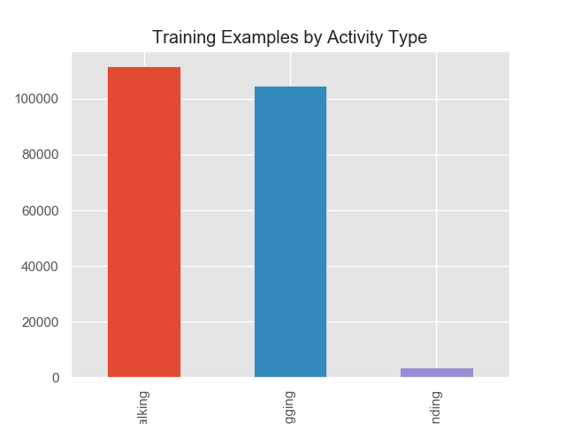
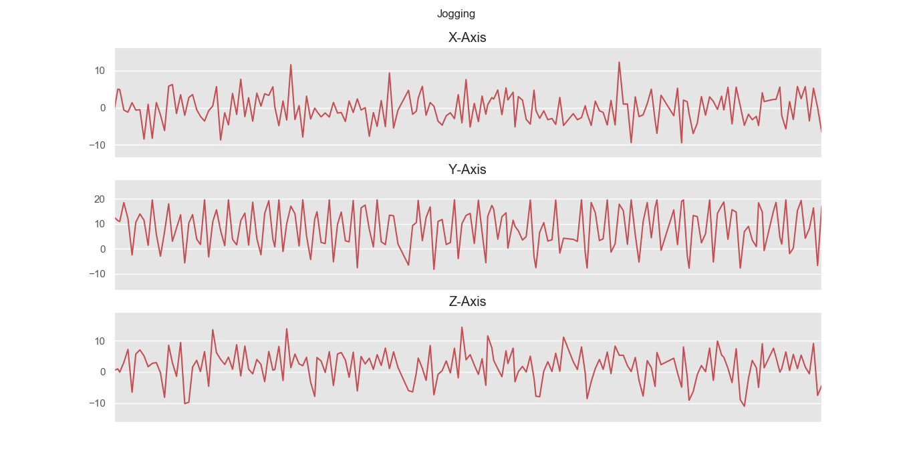
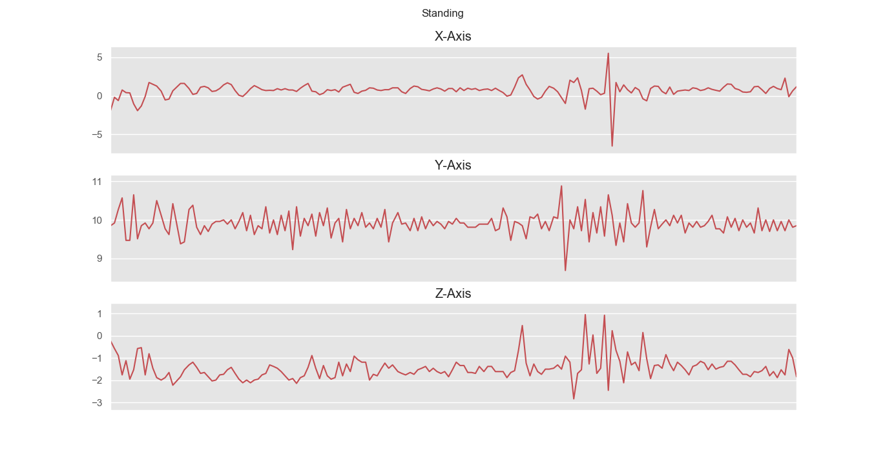
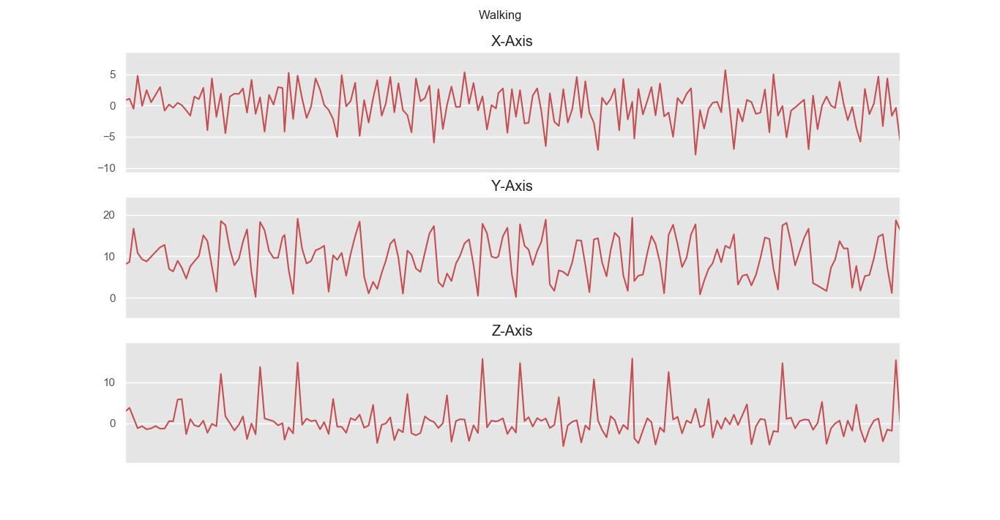
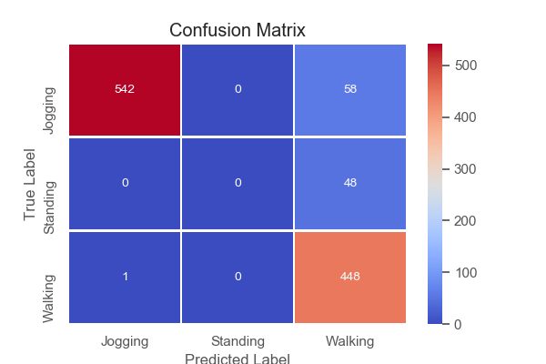
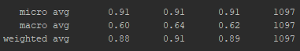

# Assignment2

### Run & Requirements Installation
In order to install and run the assignment follow the instruction below:
Note that there is a need to install python3.6 and pip3 (package manager):

    git clone https://github.com/WASP-AS1-Umea/assignment2
    pip3 install -r req.txt
    python3.6 main.py

### Results

